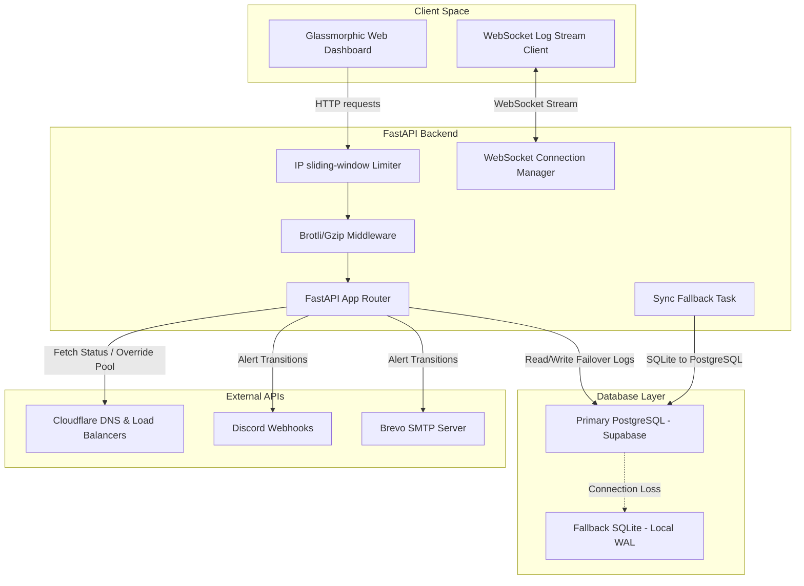

# Project Blueprint: DNS Failover Monitor & Control System (A to Z)

This blueprint documents the complete architecture, system operations, codebase logic, and deployment pathways of the **Multi-Region DNS Failover Monitor & Control Dashboard**. It is designed to act as a definitive guide explaining how the system is programmed and runs from A to Z.

---

## 🏗️ 1. System Architecture Overview

The system is designed to run 24/7 on free-tier cloud infrastructure with zero investment. It ensures high-availability DNS routing via Cloudflare Load Balancers, backed by a resilient dual-database design, dynamic rate limiting, real-time alert notifications, and a responsive glassmorphic dashboard.

---

## 💾 2. Database Layer & Resiliency (A to Z)

To survive regional internet outages and network flaps, the system operates in a **Dual-Database Active-Fallback mode**.

### 2.1 Database Engines & Session Routing
- **Primary Database**: PostgreSQL (Supabase Free Tier) configured via `DATABASE_URL`.
- **Fallback Database**: SQLite (Local file `fallback.db`) configured via `FALLBACK_DATABASE_URL`.
- **Engine Configuration (`database.py`)**:
  - SQLAlchemy `create_engine` utilizes `pool_size=10`, `max_overflow=20`, `pool_recycle=1800`, and `pool_pre_ping=True` to keep connections fresh and prevent stale handle drop-outs.
  - In testing environments (or when local SQLite databases are used as primary), the connection pool is disabled (`poolclass=NullPool`) to prevent lockups on database files by subprocesses.

### 2.2 SQLite WAL Optimization
When SQLite falls back into action, it uses optimized SQLite `PRAGMAs` triggered by SQLAlchemy event listeners:
- **`journal_mode = WAL`**: Write-Ahead Logging allows concurrent reads and writes.
- **`synchronous = NORMAL`**: Decreases the number of fsync flushes to disk.
- **`cache_size = -64000`**: Configures a 64MB cache to reduce disk reads.

### 2.3 Fallback Syncing Background Task (`_sync_fallback_to_primary`)
Started as an asynchronous loop in the FastAPI lifecycle:
1. Every 30 seconds (or customized via `DB_SYNC_INTERVAL`), the task checks primary database liveness (`SELECT 1`).
2. If the primary database becomes reachable again, it selects all logs in the SQLite fallback database that do not have `event_type = 'SYNCED'`.
3. It copies these logs into the PostgreSQL database.
4. Once written to PostgreSQL, it marks the source logs in SQLite as `'SYNCED'`.

---

## 🔌 3. Backend API & Middlewares (A to Z)

The FastAPI backend ([backend/main.py](file:///C:/Users/samde/.gemini/antigravity/scratch/dns_failover/backend/main.py)) hosts the endpoints, serves static assets, compresses responses, and manages rate limiting.

### 3.1 Authentication & Security
- Endpoints are protected by a token validation dependency (`verify_token`).
- Token extraction supports:
  1. Bearer Token: `Authorization: Bearer <API_TOKEN>`
  2. Custom Header: `X-API-Token: <API_TOKEN>`
- Unauthorized requests return `401 Unauthorized`.

### 3.2 Brotli/Gzip Response Compression
- A custom middleware (`BrotliGzipMiddleware`) wraps all API responses.
- It detects client support via the `Accept-Encoding` header:
  - If the client supports `br`, it compresses via Brotli.
  - Otherwise, it falls back to `gzip`.
- Appends `Vary: Accept-Encoding` to guarantee correct downstream caching.
- Bypasses static asset endpoints to avoid wasting CPU on pre-compressed files.

### 3.3 sliding-window Rate Limiter
- An in-memory sliding-window counter rate-limits requests per client IP.
- Default limit is 60 requests/minute.
- Supports extraction of client IP from proxy headers (prioritizing `X-Forwarded-For` and falling back to `request.client.host`).
- Blocks excess traffic with `429 Too Many Requests`.

### 3.4 API Route Definitions
- **`GET /api/v1/health/failover`**: Compiles metrics from DB latency checks, Virtual CPU, Virtual Memory, and queries active Cloudflare load balancer pools.
- **`POST /api/v1/failover/trigger`**: Secures manual override controls, sending a request to Cloudflare load balancer routing rules and logging the manual override action.
- **`GET /api/v1/keepalive`**: Responds `200 OK` with timestamp to prevent free-tier Render container sleep.
- **`GET /metrics`**: Exposes Prometheus telemetry (`http_requests_total`).

### 3.5 Real-Time WebSocket Feed (`/api/v1/logs/ws`)
1. On connection, verifies query param token `?token=<API_TOKEN>`.
2. Fetches and replays the last 20 log history entries tagged with `"source": "history"`.
3. Enters an AnyIO-based heartbeat loop sending `{"type": "ping"}` heartbeats every 30s.
4. When a new database log is written anywhere in the system, `broadcast_log(log)` is triggered, sending the live log entry to all connected clients immediately.

---

## 🔔 4. Alerting Engine (A to Z)

State changes (e.g. going from healthy to degraded, database outage, or manual overrides) trigger the alert system:
- **Discord Integration**: Delivers formatted rich embeds to Discord webhook channels instantly.
- **Email integration**: Sends alerts using Brevo's REST SMTP API.
- **Anti-Spam State Tracker**: The system keeps an in-memory status record, only executing alert requests when the status transitions (e.g. `healthy` -> `degraded`), preventing alert fatigue.

---

## 🎨 5. Glassmorphic Web Dashboard (A to Z)

The frontend ([frontend/index.html](file:///C:/Users/samde/.gemini/antigravity/scratch/dns_failover/frontend/index.html)) provides a light/dark themed cockpit for control and monitoring.

### 5.1 Glassmorphic UI & Metrics Widgets
- Built with Outfit/Inter typography, clean glassmorphic blur filters (`backdrop-filter`), and CSS gradients.
- Automatically persists light/dark mode choices using browser `localStorage`.
- Real-time animated charts track database latency, CPU usage, and Memory footprint.

### 5.2 Secure Manual Override Modal
- Forces a **5-second confirmation lock** where the confirm button is disabled, forcing the administrator to review the override destination.
- Employs a **15-second progress bar auto-cancel** where the card dismisses automatically if no action is taken.
- Supports keybinding shortcuts (`Escape` key closes all active modals instantly).

### 5.3 WebSocket Log Terminal
- Client connects via `connectWebSocket()` on page load.
- Real-time audit logs are appended to the terminal dynamically with a green indicator border and `logSlideIn` slide-in animations.
- **Log collapsing & deduplication**: Streams are matched against a sliding deduplication window: consecutive duplicate logs collapse automatically under a single line with a counter badge (e.g., `x5`) to ensure a clean interface.
- Automatically attempts connection recovery within **5 seconds** on disconnect.

---

## 🧪 6. Testing Rigor & CI/CD Verification

The test harness uses Pytest to verify system components in isolation and end-to-end:
- **`tests/test_milestone1.py`**: Validates Brotli/Gzip compression, static asset headers, and sliding-window rate limit boundaries.
- **`tests/test_milestone2_3.py`**: Verifies keepalive endpoints, SQLite fallback log marking, and mock WebSocket manager broadcasts.
- **`tests/e2e/` (E2E Test Suite)**:
  - Spawns the uvicorn backend on port 8000 and a mock API server on port 8001.
  - Automatically tests rate limiting triggers, WebSocket connection lifecycles, and database syncing during simulated SQLite write-locks.
- **Socket Safety Hook**: Checks that socket handles on port 8000/8001 are fully released by the OS before starting tests, preventing port-collision errors.
